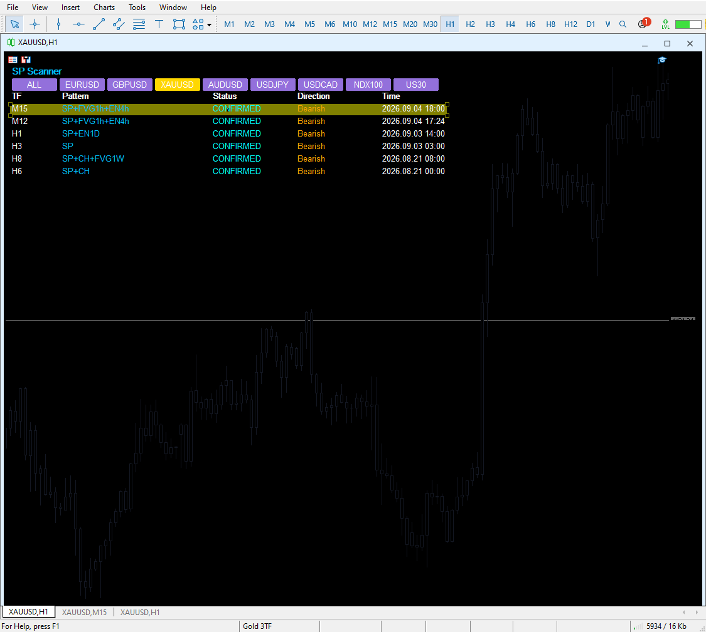
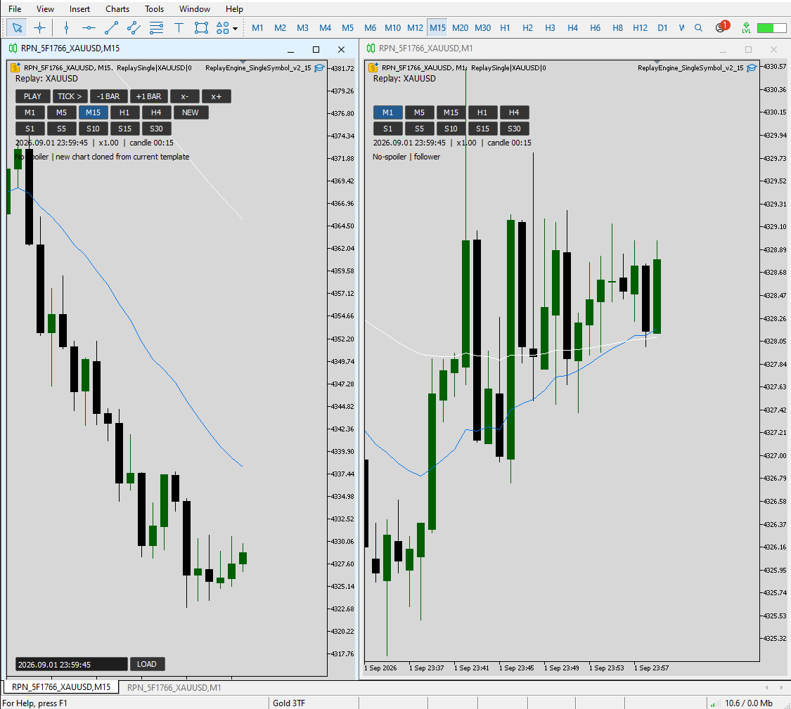
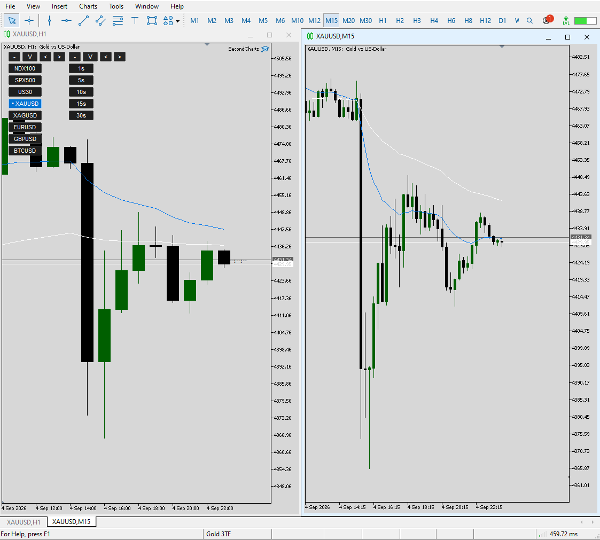

# Quantitative Trading Research & MT5 Research Tooling

Selected public work samples covering proprietary market-structure research, manual
backtesting infrastructure, and MT5 workflow extensions.

**Author:** Hadis Arefanjazi

> **Public-evidence repository:** implementation details and source code are intentionally
> withheld to protect proprietary work.

## Work Sample

**[View the full Quant Trading Work Sample (PDF)](docs/Quant_Trading_Work_Sample.pdf)**

## Featured Projects

| Project | Focus | Public evidence |
|---|---|---|
| [Settlement Pivot Edge](projects/settlement-pivot/) | Market-structure edge + matched-control validation | Aggregate results, methodology, screenshots |
| [No-Look-Ahead Manual Backtesting Engine](projects/manual-backtesting-engine/) | Operator-driven historical backtesting with synchronized charts and configurable second-based periods | Screenshots + high-level design |
| [MT5 Live Research Toolkit](projects/mt5-research-toolkit/) | SymbolJump, SecondCharts, SyncedCharts | Screenshots + feature descriptions |

---

## 1. Settlement Pivot Edge

I developed a proprietary market-structure edge designed to identify conditions where a
strong directional impulse, structured correction, and subsequent break can create an
increased expectation of at least a partial market settlement or reversal.

The **edge is not itself an entry rule**. Practical execution requires evidence of
momentum change on a lower fractal/timeframe. For historical validation, a deliberately
simple close-based confirmation proxy was used so the underlying edge could be tested
consistently.



### Selected matched-baseline results

| Segment | N | Edge-event success | Matched baseline | Lift |
|---|---:|---:|---:|---:|
| Overall M30+H1 | 234 | 40.9% | 35.7% | +5.2 pp |
| M30 overall | 166 | 41.6% | 36.9% | +4.6 pp |
| M30 Bullish | 69 | 45.3% | 37.3% | +8.0 pp |
| H1 overall | 68 | 39.4% | 32.6% | +6.8 pp |
| H1 Bearish | 38 | 41.7% | 29.2% | +12.5 pp |

See **[validation methodology](docs/VALIDATION_METHOD.md)** and the sanitized aggregate
files in [`evidence/`](evidence/).

---

## 2. No-Look-Ahead Manual Backtesting Engine

A custom, operator-driven MT5 backtesting environment combining:

- no-look-ahead historical replay,
- synchronized multi-chart review,
- native and **user-configurable second-based timeframes**,
- step controls and variable replay speed,
- leader/follower chart behavior.

The operator can define the second-based periods needed for a specific workflow rather
than being restricted to a fixed set of examples.



At the time of development, I had not encountered an MT5 workflow combining this set of
capabilities in one integrated manual-backtesting environment.

---

## 3. MT5 Live Research Toolkit

The live toolkit extends practical MT5 workflow through three integrated tools:

- **SymbolJump** — rapid symbol switching while preserving chart organization and template context.
- **SecondCharts** — user-configurable live second-based chart periods with fast switching and one-click return to the standard chart.
- **SyncedCharts** — synchronized time, crosshair, and drawing-object alignment across linked charts.



The goal is not to replace MetaTrader, but to extend platform behavior for faster
multi-symbol, multi-timeframe discretionary research.

---

## Repository Contents

```text
.
├── README.md
├── IP_NOTICE.md
├── docs/
│   ├── Quant_Trading_Work_Sample.pdf
│   └── VALIDATION_METHOD.md
├── evidence/
│   ├── validation_summary.csv
│   └── m30_bullish_yearly_lift.csv
├── projects/
│   ├── settlement-pivot/
│   ├── manual-backtesting-engine/
│   └── mt5-research-toolkit/
└── assets/

```

## Related Quantitative / ML Research

- [Resource-Aware Active Sensing and Control](https://github.com/HadisArefanJazi/resource-aware-active-sensing-control)  
  Constrained reinforcement learning for joint control and information allocation under partial observability and explicit resource budgets.

---

## Research / IP Note

This repository intentionally excludes:

- `.mq5` / `.ex5` source or compiled implementation files,
- proprietary scanner logic and thresholds,
- full event-level signal histories,
- reconstruction-enabling implementation details.

Historical results are presented as research evidence only and are not a guarantee of
future performance.
