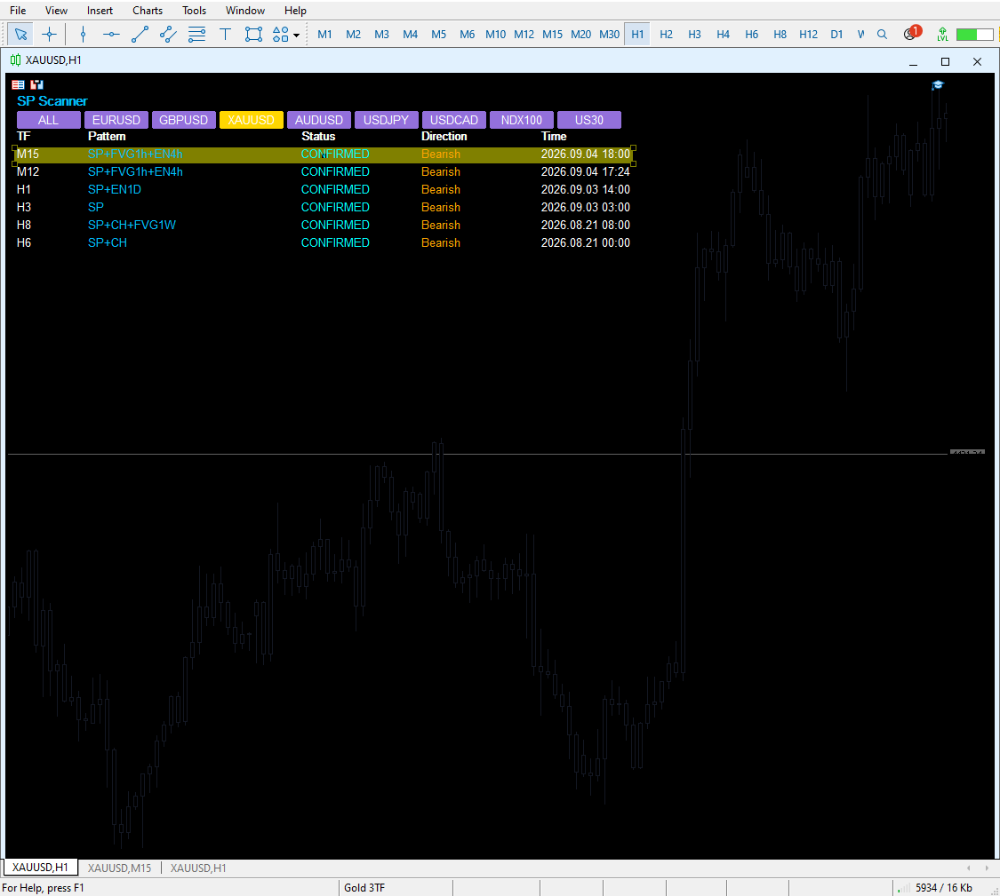
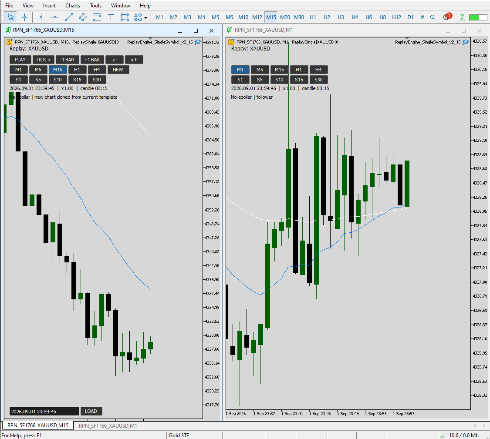
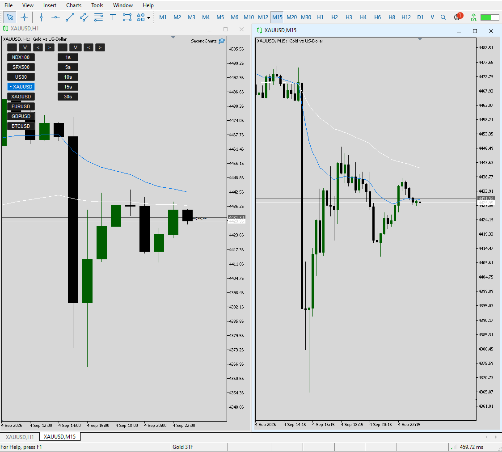

# Quantitative Trading Research & MT5 Research Tooling

Selected public work samples covering proprietary market-structure research, historical validation, manual backtesting infrastructure, and MT5 workflow extensions.

**Author:** Hadis Arefanjazi

> **Public-evidence repository:** implementation details and source code are intentionally withheld to protect proprietary work.

## Research Approach

My general research process is:

**Observe → Hypothesize → Formalize → Implement → Validate**

I begin by observing recurring market behavior, formulate a hypothesis about the underlying structure, translate that hypothesis into explicit mechanical rules, implement tools to detect or study it consistently, and finally test whether the resulting signal contains information beyond an appropriate market baseline.

---

## Work Sample

**[View the full Quant Trading Work Sample (PDF)](docs/Quant_Trading_Work_Sample.pdf)**

---

## Featured Projects

| Project | Focus | Public Evidence |
|---|---|---|
| [Settlement Pivot Edge](projects/settlement-pivot/) | Proprietary market-structure edge and matched-control validation | Aggregate results, methodology, screenshots |
| [No-Look-Ahead Manual Backtesting Engine](projects/manual-backtesting-engine/) | Historical replay with synchronized charts and configurable second-based periods | Screenshots and high-level design |
| [MT5 Live Research Toolkit](projects/mt5-research-toolkit/) | SymbolJump, SecondCharts, SyncedCharts | Screenshots and feature descriptions |

---

## 1. Settlement Pivot Edge

### Research Origin

The original hypothesis was partly inspired by Wyckoff's accumulation and distribution framework, particularly the idea that meaningful directional transitions often develop through structured phases rather than isolated price movements.

I used this as a conceptual starting point rather than as a trading rule. Through repeated market observation and manual testing, I identified more specific recurring structures and gradually translated them into explicit mechanical rules that could be detected and tested objectively.

### Research Question

The research asks whether a specific higher-level market structure can identify conditions in which a strong directional impulse, structured correction, and subsequent break are followed by an increased probability of at least a partial settlement, correction, or reversal.

The **edge is not itself an entry rule**.

Practical execution requires separate evidence of momentum change on a lower fractal or timeframe. This allows the structural edge and the execution logic to be studied separately.

### What I Built

I developed a proprietary multi-timeframe scanner that operationalizes the market-structure hypothesis and reports bullish or bearish edge candidates.

For historical validation, I used a deliberately simple and standardized close-based confirmation proxy. The purpose was not to optimize an entry strategy, but to evaluate the underlying structural edge under a consistent rule.



### Selected Matched-Control Results

| Segment | Signal Total N | Signal Evaluable N | Control Total N | Control Evaluable N | Signal Success | Matched Baseline | Lift |
|---|---:|---:|---:|---:|---:|---:|---:|
| Overall M30+H1 | 234 | 220 | 1,170 | 1,107 | 40.9% | 35.7% | +5.2 pp |
| M30 overall | 166 | 154 | 830 | 788 | 41.6% | 36.9% | +4.6 pp |
| M30 Bullish | 69 | 64 | 345 | 332 | 45.3% | 37.3% | +8.0 pp |
| H1 overall | 68 | 66 | 340 | 319 | 39.4% | 32.6% | +6.8 pp |
| H1 Bearish | 38 | 36 | 190 | 178 | 41.7% | 29.2% | +12.5 pp |

The primary success rates exclude observations classified as `AMBIGUOUS_SAME_BAR`, where both the target and invalidation level were reached within the same bar and their ordering cannot be determined from the available bar-level data.

As a conservative sensitivity check, treating all same-bar ambiguous observations as failures still produces a positive overall lift of approximately **+4.7 percentage points**.

See **[Validation Methodology](docs/VALIDATION_METHOD.md)** for details.

---

## 2. No-Look-Ahead Manual Backtesting Engine

### Research Problem

MT5 does not natively provide the combination I needed for discretionary market research: operator-driven historical replay, synchronized multi-chart analysis, configurable second-based periods, and controlled release of historical information.

### What I Built

I developed a custom manual backtesting environment combining:

- a single simulated replay clock,
- no-look-ahead historical replay,
- synchronized leader/follower charts,
- native MT5 timeframes,
- user-configurable second-based periods,
- variable replay speed,
- step controls,
- and parallel multi-chart review.

Only historical information available up to the simulated replay timestamp is exposed to the operator, reducing future-bar leakage during manual testing.



### Design Contribution

At the time of development, I had not found an MT5 solution that combined these capabilities in the integrated workflow required for my research.

The objective was to create research infrastructure that made multi-timeframe observation more controlled, efficient, and reproducible.

---

## 3. MT5 Live Research Toolkit

### Research Problem

While using MT5 extensively for market research, I found several workflow limitations that created unnecessary friction in multi-symbol and multi-timeframe analysis.

I therefore developed an integrated extension layer consisting of three main tools.

### SymbolJump

Provides rapid symbol switching while preserving chart organization, template context, and the existing research workspace.

### SecondCharts

MT5 does not provide native second-based chart periods.

SecondCharts provides user-configurable second-based views with fast switching between them and one-click return to the standard chart, without forcing the researcher into a separate-chart workflow.

### SyncedCharts

Synchronizes time position, crosshair location, and drawing objects across linked charts, including standard and second-based views.



### Design Contribution

The main contribution is the integration of:

**persistent workspace + rapid symbol switching + configurable second-based periods + synchronized multi-chart analysis**

At the time of development, I had not encountered an MT5 workflow using this exact combination.

---

## Repository Contents

```text
.
├── README.md
├── IP_NOTICE.md
├── docs/
│   ├── Quant_Trading_Work_Sample.pdf
│   └── VALIDATION_METHOD.md
├── evidence/
│   ├── validation_summary.csv
│   └── m30_bullish_yearly_lift.csv
├── projects/
│   ├── settlement-pivot/
│   ├── manual-backtesting-engine/
│   └── mt5-research-toolkit/
└── assets/

```

## Related Quantitative / ML Research

- [Resource-Aware Active Sensing and Control](https://github.com/HadisArefanJazi/resource-aware-active-sensing-control)  
  Constrained reinforcement learning for joint control and information allocation under partial observability and explicit resource budgets.

---

## Research / IP Note

This repository intentionally excludes:

- `.mq5` / `.ex5` source or compiled implementation files,
- proprietary scanner logic and thresholds,
- full event-level signal histories,
- reconstruction-enabling implementation details.

Historical results are presented as research evidence only and are not a guarantee of
future performance.
