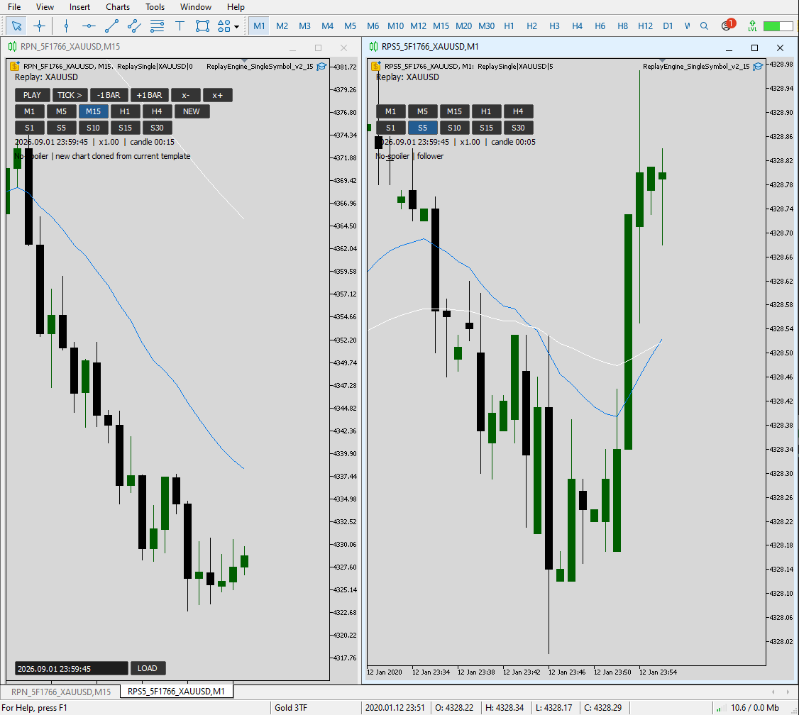
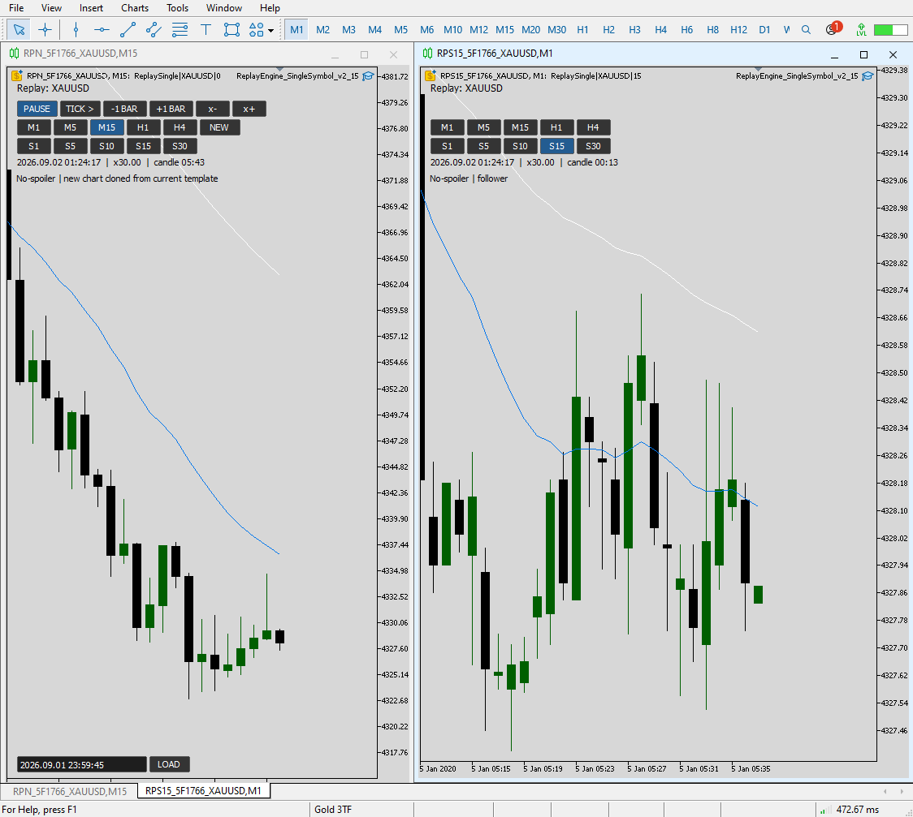

# No-Look-Ahead Manual Backtesting Engine

## Problem

MT5 does not natively provide the combination needed for this discretionary research
workflow: operator-driven historical backtesting, synchronized multi-chart replay, and
flexible second-based chart periods while preventing future-bar leakage.

## What I built

A custom manual backtesting and replay environment with:

- a single simulated replay clock,
- no-look-ahead bar release,
- synchronized leader/follower charts,
- native MT5 timeframes,
- **user-configurable second-based periods**,
- variable playback speed,
- bar-step controls,
- parallel multi-chart review.

The second-based intervals are configurable by the user; examples such as S1, S5, S10,
S15, and S30 are illustrative rather than fixed limits.

## Design contribution

At the time of development, I had not encountered an MT5 workflow that combined
no-look-ahead manual backtesting, synchronized multi-chart replay, and configurable
second-based periods in one integrated environment.

## IP

Source code and implementation details are intentionally withheld.
