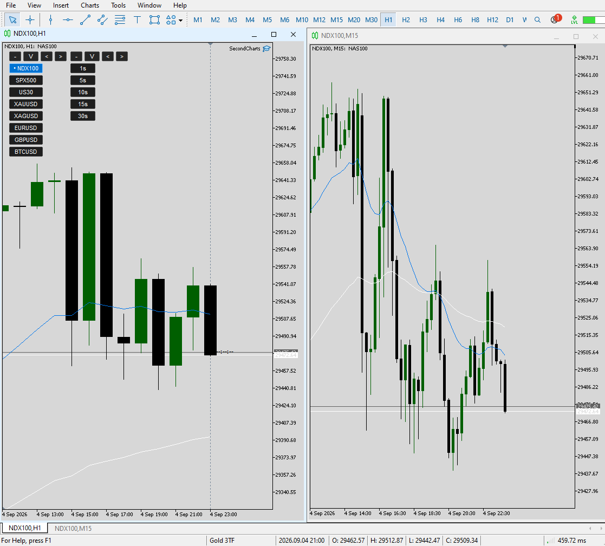
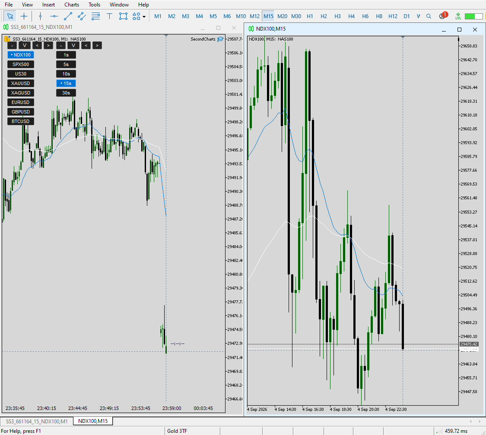
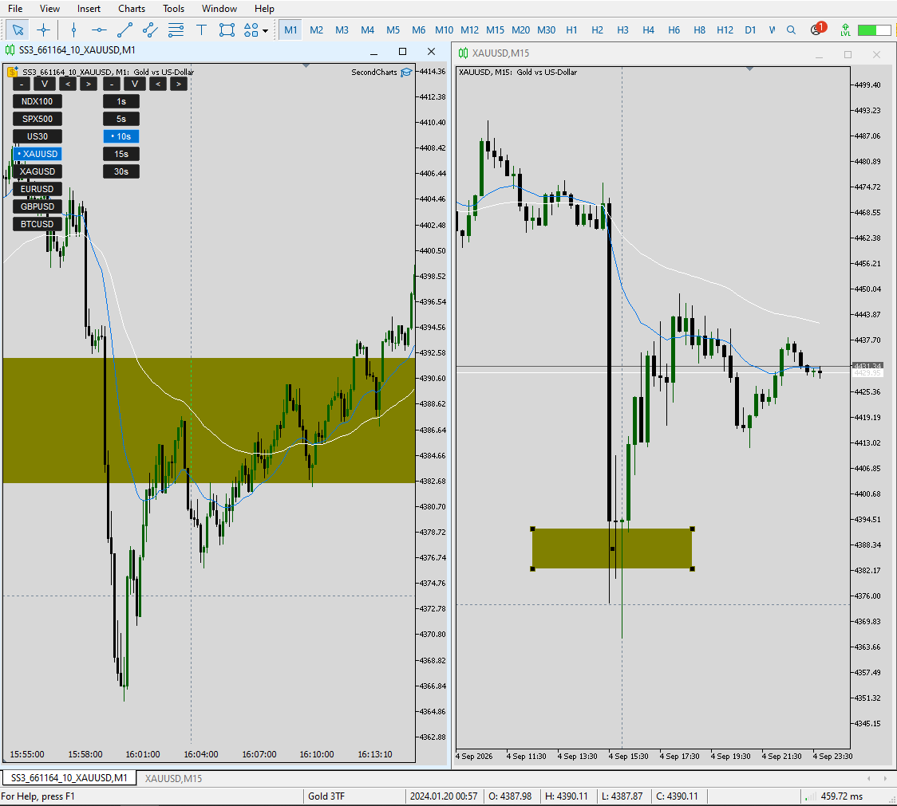

# MT5 Live Research Toolkit

## Goal

Extend MT5 into a faster, more persistent live research workspace without forcing the
operator to repeatedly rebuild chart context.

## Components

### SymbolJump

Repeated symbol changes in MT5 can reload chart/template context and disrupt the working
layout. SymbolJump provides one-click symbol switching while preserving the research
workspace, chart organization, and template context.

### SecondCharts

MT5 has no native second-based chart periods. SecondCharts provides live,
**user-configurable** second-based views and fast switching between them, with one-click
return to the standard chart rather than requiring the user to work in a separate custom
chart workflow.

### SyncedCharts

Synchronizes time, crosshair position, and drawing objects across linked charts,
including standard and second-based views.

## Evidence

## Design contribution

The contribution is the integration: persistent layout, rapid symbol switching,
configurable second-based access, and synchronized multi-chart analysis in one practical
MT5 workflow.

At the time of development, I had not encountered an MT5 workflow using this exact
combination.

## IP

Source code and reconstruction-enabling implementation details are intentionally withheld.
