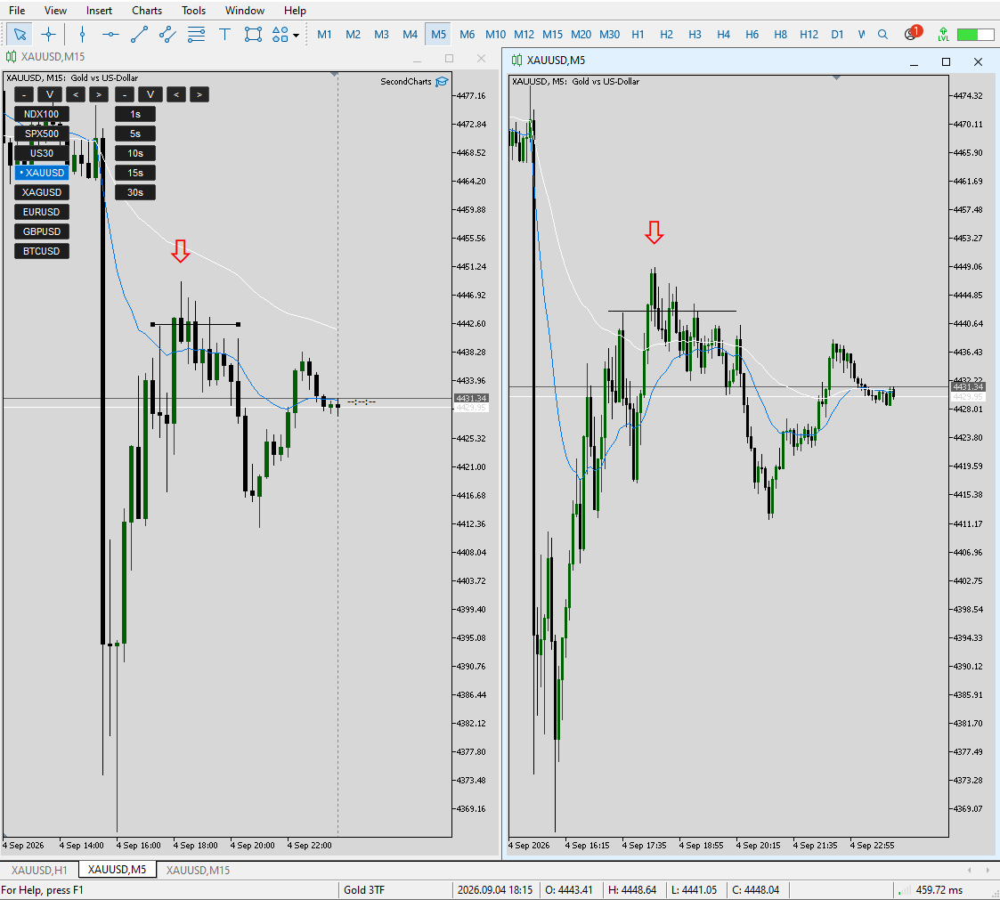
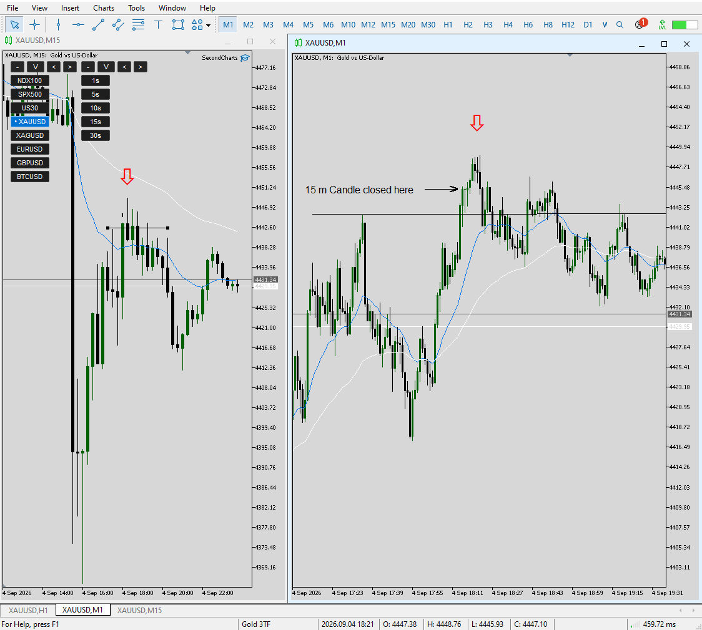

# Settlement Pivot Edge

## Problem

A directional market move can remain strong even after a local break. The research
question is whether a specific higher-level market structure can identify situations
where the probability of at least a partial settlement/correction or reversal is higher
than under comparable market conditions.

## What I built

A proprietary market-structure scanner that searches for a structured sequence involving:

**strong impulse → structured correction → subsequent break → settlement/reversal edge**

The edge identifies a higher-level opportunity rather than a mechanical entry point.
Execution should be supported by evidence of momentum change on a lower fractal/timeframe.

For the historical experiment, a simple standardized close-based confirmation proxy was
used to evaluate the edge consistently. Other lower-fractal momentum-change structures
can also be used in discretionary execution.

## Validation

Method: **Matched-Control Event Study / Matched-Baseline Historical Validation**

Each post-confirmed signal was paired with five non-signal observations matched on
timeframe, market timing, and volatility. Both groups were subjected to the same outcome
test.

See:
- [Validation method](../../docs/VALIDATION_METHOD.md)
- [Aggregate results](../../evidence/validation_summary.csv)

## IP

Signal logic, thresholds, and parameterization are intentionally withheld.
