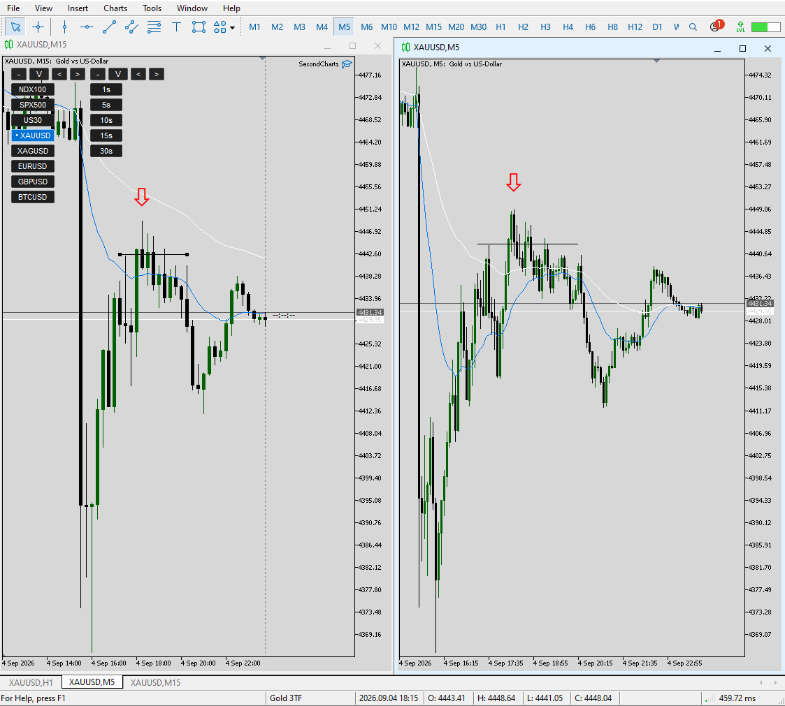
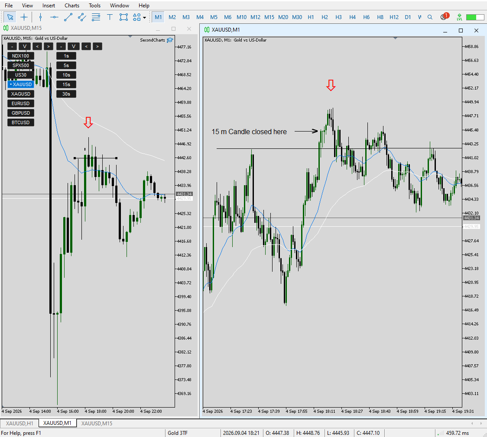

# Settlement Pivot Edge

## Problem

A directional market move can remain strong even after a local break. The research
question is whether a specific higher-level market structure can identify situations
where the probability of at least a partial settlement/correction or reversal is higher
than under comparable market conditions.

## Research Origin

The original hypothesis was partly inspired by Wyckoff's accumulation and distribution framework, particularly the idea that meaningful directional transitions often develop through structured phases rather than isolated price movements.

I used this only as a conceptual starting point. Through repeated market observation and manual testing, I identified more specific recurring structures and gradually translated them into explicit mechanical rules that could be detected and tested objectively.

## What I built

A proprietary market-structure scanner that searches for a structured sequence involving:

**strong impulse → structured correction → subsequent break → settlement/reversal edge**

The edge identifies a higher-level opportunity rather than a mechanical entry point.
Execution should be supported by evidence of momentum change on a lower fractal/timeframe.

For the historical experiment, a simple standardized close-based confirmation proxy was
used to evaluate the edge consistently. Other lower-fractal momentum-change structures
can also be used in discretionary execution.

## Validation

Method: **Matched-Control Event Study / Matched-Baseline Historical Validation**

Each post-confirmed signal was paired with five non-signal observations selected from comparable market conditions.

Matching considered:

- the same timeframe,
- the same evaluated bullish or bearish direction,
- similar market timing,
- and a similar volatility regime.

Both signal and control observations were subjected to the same objective future-outcome test.

Same-bar observations where target-versus-invalidation ordering could not be determined were classified as `AMBIGUOUS_SAME_BAR` and excluded from the primary success-rate calculation.

See:
- [Validation method](../../docs/VALIDATION_METHOD.md)
- [Aggregate results](../../evidence/validation_summary.csv)

## IP

Signal logic, thresholds, and parameterization are intentionally withheld.
